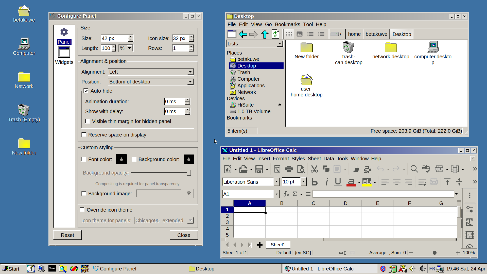

# LXQt Classic Look



This is a guide on how to achieve the classic look in LXQt in these screenshots. Everything that is needed is found in the repository. You can `git clone` the repository or download the zip file directly.

## Openbox

- Put the `Micro95` folder in `~/.themes`.
- Set the openbox theme in **Openbox Configuration Manager**.

## LXQt theme

- Put the `Why2K` folder in `~/.local/share/lxqt`.
- Set the LXQt theme in **LXQt Theme** of **Appearance** settings.

## Icons

- Put the `Chicago95_extended` folder in `~/.icons`.
- Set the icons theme in **Icons Theme** of **Appearance** settings.

I added some extra icons to the original `Chicago95` icon set.

## Cursors

- Put the desired cursor folder in `~/.icons`.
- Set the cursor theme in **Cursor** of **Appearance** settings.

I use `Chicago95 Standard Cursors` for the classic white cursors.

## GTK theme

- Put the `Windows95` folder in `~/.local/share/themes`.
- Set the GTK theme in **Widget Style** of **Appearance** settings.

## Qt theme

- Set the Qt style in **Widget Style** of **Appearance** settings to **Windows**.

## SDDM

- Put the `reactionary` folder in `/usr/share/sddm/themes`.

- Edit `/etc/sddm.conf` and set the SDDM theme and cursor under the `[Theme]` section.

```conf
[Theme]
# Current theme name
Current=reactionary

# Cursor theme used in the greeter
CursorTheme=Chicago95 Standard Cursors
```

### SDDM fails to start

This may be caused by missing the following packages: `qt5-qtgraphicaleffects`, `qt5-qtquickcontrols`, `qt5-qtquickcontrols2`. Try installing these packages on your system.

## Application menu icon

The classic icon can be found in the icon set with varying sizes. I personally use `~/.icons/Chicago95_extended/apps/24/wine.png`.

- Right click on the application menu button to set the icon.

## Background colour

- Set the background colour to `#3d71a3` for that beautiful blue.

## Fonts

I personally like to use **Liberation Sans**, which is also the font used in the SDDM theme.

## Credits

- GTK theme: [B00merang-Project/Redmond-Themes](https://github.com/B00merang-Project/Redmond-Themes)
- Cursors and icons theme: [grassmunk/Chicago95](https://github.com/grassmunk/Chicago95)
- Openbox theme: [Micro 95](https://www.box-look.org/p/1017307/)
- LXQt theme: [Why2K](https://store.kde.org/p/1292579/)
- SDDM theme: [Reactionary](https://store.kde.org/p/1376447/)
